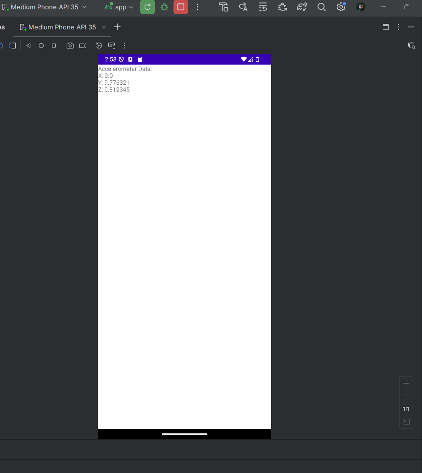

# AndroidStudio Practice Projects
Some learning projects I have created for CS-360 (Mobile Architect &amp; Programming)

## Overview

This repository contains three Android Studio projects that I have developed as part of my CS-360 coursework. Each project demonstrates different aspects of mobile app development, focusing on user interface design, sensor management, and basic app functionality. Below is a brief description of each project along with screenshots.

---

### 1. **Module Three App**
   - **Description**: This app is a simple interactive application where the user can input their name and press a button to display a greeting. The app is focused on basic UI elements like `EditText` and `Button`, and demonstrates how to handle user input and display it on the screen.

     

---

### 2. **Project 2 App**
   - **Description**: This app is a more advanced user interface design that includes a login screen. The user can either log in or create a new account. The UI design follows best practices for user input, ensuring that the password is hidden when typed, and buttons are clearly labeled and positioned. This project showcases the layout design skills I've developed.

     

---

### 3. **Sensor Manager App**
   - **Description**: The Sensor Manager App is a simple application that demonstrates the use of the `SensorManager` class to interact with the device's accelerometer. The app reads the x, y, and z values of the accelerometer and displays them on the screen. This project highlights the basics of working with hardware sensors in Android.

     

---

Feel free to explore the projects by cloning the repository or downloading the ZIP files. Each project is an example of how to implement specific features and concepts in Android development.
